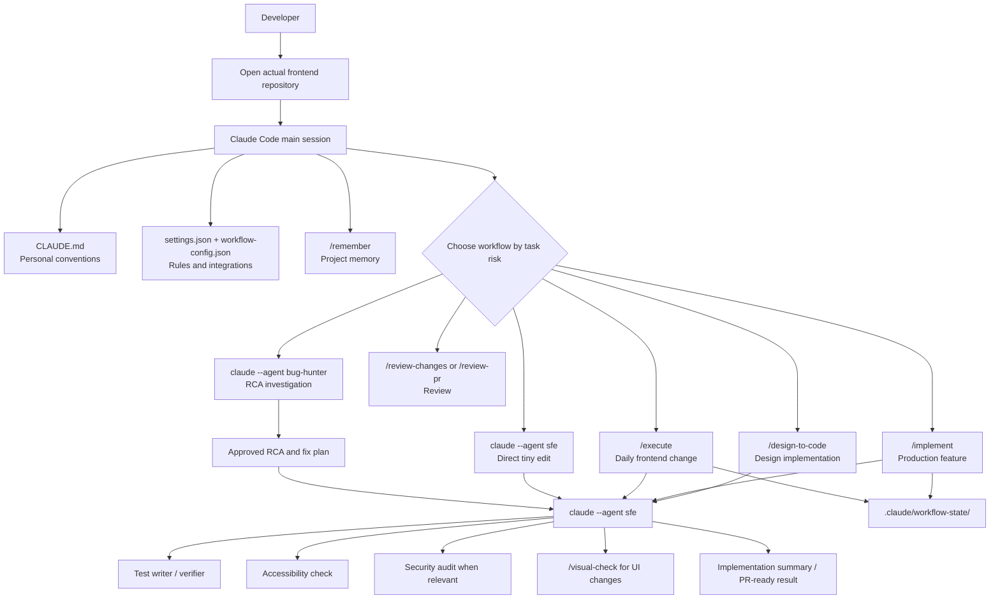
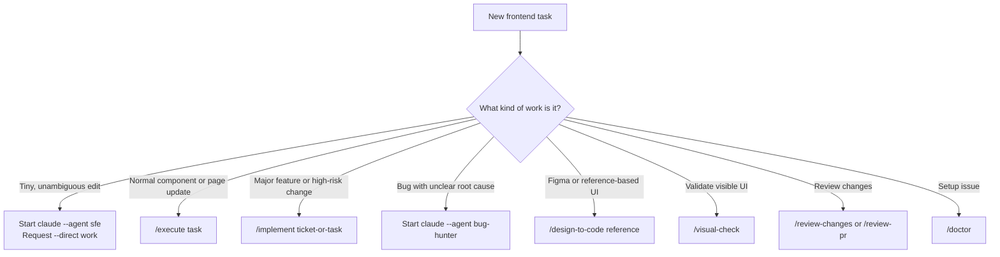
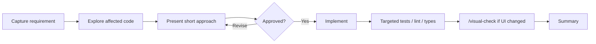
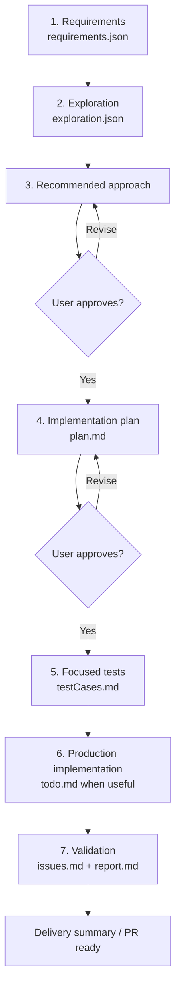
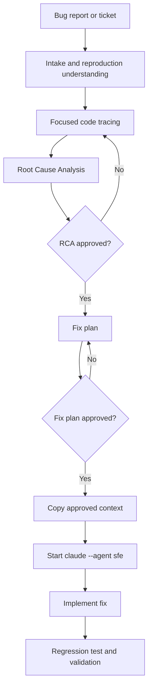
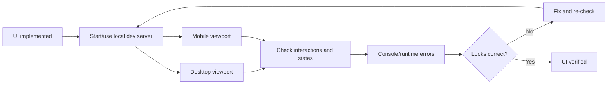

# Claude FE Agent V2

A personal Claude Code toolkit for frontend engineering. It gives Claude a
clear, repeatable process for daily UI work, production features, bug
investigation, design implementation, validation, and remembered project
context across React, Vue, Next.js, and similar frontend repositories.

This repository is **not a frontend application**. It is the configuration
layer used by Claude Code while working inside actual application repositories.

## Core Idea

```text
Understand the requirement
-> inspect the existing project
-> choose an appropriate workflow
-> reuse current patterns
-> implement
-> validate code and rendered UI
-> report clearly
```

V2 is designed around one rule:

> Use the lightest workflow that still protects the quality of the change.

---

## Repository vs Target Project

There are two locations involved in daily use:

| Location | Purpose |
| --- | --- |
| `claude-fe-agent` repository | Stores agents, skills, personal context, integration config, and reusable workflow definitions |
| Actual frontend repository | Where Claude reads and edits application code and writes task state |

Example:

```text
/Users/yashverma/Desktop/claude-fe-agent
  -> toolkit configuration

/Users/yashverma/Desktop/Lambdatest Clients/my-frontend-app
  -> the actual project where /execute or /implement works
```

Do not run feature implementation inside `claude-fe-agent` unless you are
changing this toolkit itself.

---

## How The Toolkit Is Active

`setup.sh` links this repository into Claude Code's user-level configuration:

```text
~/.claude/CLAUDE.md             -> <claude-fe-agent>/CLAUDE.md
~/.claude/settings.json         -> <claude-fe-agent>/settings.json
~/.claude/workflow-config.json  -> <claude-fe-agent>/workflow-config.json
~/.claude/skills                -> <claude-fe-agent>/skills
~/.claude/agents                -> <claude-fe-agent>/agents
~/.claude/memory                -> <claude-fe-agent>/memory, when no local memory exists
```

Because these are symlinks:

```text
Change in this repository
-> change in ~/.claude
-> change in Claude Code behavior
```

Always use a branch for workflow changes and review them before merging.

---

## Architecture



---

## Principles

- Use a small workflow for small edits and a complete workflow for high-risk work.
- Inspect the target project's code, dependencies, and conventions before editing.
- Reuse existing components, hooks, tokens, state/API patterns, and tests.
- Treat browser verification as required for visible UI changes.
- Preserve approval gates for important technical approaches and bug fixes.
- Let specialist agents report or test; the primary implementation agent owns production code.
- Do not pre-approve destructive shell actions in the global Claude setup.

---

## Start A Working Session

### First Time In A Frontend Project

```bash
cd /path/to/your-frontend-project
claude --agent sfe
```

Inside Claude Code:

```text
/remember
```

This stores stable project understanding, such as framework, folder layout,
component library, styles, state/data patterns, and tests.

### Returning To A Known Project

```bash
cd /path/to/your-frontend-project
claude --agent sfe
```

Then directly run the appropriate workflow, for example:

```text
/execute add an empty state to the reports table
```

Refresh memory when the project architecture changes:

```text
/remember --refresh
```

---

## Which Workflow Should I Use?



| Task | Invocation | Result |
| --- | --- | --- |
| Copy, spacing, icon, URL, or tiny accessibility edit | Start `claude --agent sfe`, ask for `--direct` implementation | Minimal edit and focused check |
| Filter, skeleton, validation, responsive fix, normal UI enhancement | `/execute <task>` | Focused exploration, approved approach, implementation, targeted verification |
| Jira feature, new flow, significant refactor, sensitive change | `/implement <ticket-or-task>` | Full approved production workflow |
| Bug needing diagnosis or RCA | Start `claude --agent bug-hunter` | RCA and fix plan before implementation |
| Figma/screenshot-based UI work | `/design-to-code <reference>` | Design-system-aware UI implementation |
| Rendered UI confidence | `/visual-check` | Desktop/mobile browser verification |
| Local source review | `/review-changes` | Code quality/a11y findings |
| PR review | `/review-pr <PR URL>` | PR findings |
| Security-sensitive code | `/security-audit` | Security findings |
| Project context memory | `/remember` | Persistent project understanding |
| Setup diagnosis | `/doctor` | Read-only toolkit health report |

---

## Agent Model

### Primary Agents

| Agent | Start Command | Responsibility |
| --- | --- | --- |
| `sfe` | `claude --agent sfe` | Short-name primary frontend implementation agent |
| `senior-frontend-developer` | `claude --agent senior-frontend-developer` | Full-name equivalent primary implementation agent |
| `bug-hunter` | `claude --agent bug-hunter` | Investigation, RCA, and fix-plan handoff only |

### Specialist Agents

| Agent | Responsibility | Must Not Do |
| --- | --- | --- |
| `test-writer` | Write focused tests using current project patterns | Modify production code |
| `test-case-verifier` | Run tests and update test status | Fix implementation |
| `code-reviewer` | Report correctness, quality, reuse, performance, and testing findings | Silently rewrite feature code |
| `a11y-checker` | Report WCAG-related UI/accessibility findings | Own feature implementation |

### Orchestration Rule

Claude Code specialist subagents are workers, not nested orchestrators. Run
`sfe` or `senior-frontend-developer` as the **main session agent** when you
want coordinated implementation, testing, review, and UI validation.

---

## Workflow 1: Direct Tiny Change

Use for:

- a typo or UI copy update
- a simple URL/import replacement
- one missing `aria-label`
- a small spacing/token adjustment

Start:

```bash
cd /path/to/project
claude --agent sfe
```

Example request:

```text
Use --direct mode to change the empty state title in ReportsTable.
```

Process:

```text
Read relevant file
-> make the smallest edit
-> run the smallest relevant check
-> summarize result
```

Rules:

- No workflow-state files.
- No formal plan.
- No broad refactor.
- If the edit exposes bigger risk, move to `/execute` or `/implement`.

---

## Workflow 2: `/execute` For Daily Frontend Work

Use for:

- adding a filter
- creating a loading or empty state
- improving form validation
- fixing responsive layout
- creating a normal reusable component

Example:

```text
/execute add a status filter to the accessibility results table
```



Process:

1. Capture expected behavior and key edge cases.
2. Inspect affected files and existing reusable patterns.
3. Present a concise approach and wait for approval.
4. Implement following the existing project structure.
5. Run targeted validation.
6. For rendered UI, run `/visual-check`.

This workflow skips:

- formal `plan.md`
- dedicated TDD phase
- full review report

It does not skip practical validation.

State artifacts:

```text
.claude/workflow-state/state.json
.claude/workflow-state/requirements.json
.claude/workflow-state/exploration.json
.claude/workflow-state/progress.md
```

Upgrade to `/implement` if the task becomes broad, architecture-sensitive,
security-sensitive, or introduces a major new user flow.

---

## Workflow 3: `/implement` For Production Features

Use for:

- a Jira ticket feature
- a new page or flow
- an important refactor
- a major fix after approved RCA
- changes with broad impact or sensitive behavior

Examples:

```text
/implement TTN-12345
/implement add onboarding verification flow
```



### Phase Details

| Phase | What Happens | Typical Output |
| --- | --- | --- |
| Requirements | Fetch/collect task details, acceptance criteria, design links, dependencies, scope | `requirements.json` |
| Exploration | Load memory, inspect analogous components, tokens, routes, API/state/test patterns | `exploration.json` |
| Approach | Explain recommended solution, important alternatives, and risks | User approval |
| Plan | Define files, data flow, UI states, a11y, tests, validation | `plan.md` |
| Tests | Add or extend focused behavioral/regression tests where supported | `testCases.md` |
| Implementation | Write approved production code using existing patterns | Source changes, optional `todo.md` |
| Validation | Run relevant code checks, UI checks, reviews, and security/a11y checks where necessary | `issues.md`, `report.md` |

### Validation Selection

| Change Type | Required Validation |
| --- | --- |
| Any implementation | Relevant tests and configured lint/type/build checks |
| Visible UI or responsive layout | `/visual-check` at desktop and mobile sizes |
| Interactive UI or form | Accessibility review |
| Auth, storage, redirects, raw HTML, external inputs, sensitive API behavior | `/security-audit` |
| Meaningful multi-file change | `/review-changes` |

`/implement` is the full workflow contract. It is intentionally not used for
small tasks.

---

## Workflow 4: Bug Investigation and Fix Handoff

Use for bugs where the cause is not already obvious or where an evidence-based
analysis matters.

Start:

```bash
cd /path/to/project
claude --agent bug-hunter
```

Then describe the bug or provide the Jira ticket:

```text
Investigate TTN-45678.
```



`bug-hunter` does not edit production code. After the fix plan is approved:

```bash
claude --agent sfe
```

Provide the approved RCA and fix plan, then let `sfe` implement and validate.

---

## Workflow 5: Design-To-Code and Visual Verification

### `/design-to-code`

Use for a Figma link, screenshot, or visual reference.

The implementation should:

- detect the existing framework and UI/component library
- reuse project components before creating new primitives
- use theme/design tokens rather than hardcoded visual values
- implement affected states such as loading, empty, disabled, error, hover,
  focus, selected, and responsive variants

### `/visual-check`

Use after any visible component/page/layout change.



Visual checks cover:

- clipping, overlap, blank regions, and overflow
- readable and correctly fitting text
- responsive layout at desktop and narrow mobile sizes
- changed interaction and status states
- basic keyboard and labelling behavior
- console errors and relevant failed requests/resources

---

## Project Memory: `/remember`

`/remember` stores stable knowledge about an actual frontend repository so
future sessions start with context.

Commands:

```text
/remember
/remember --refresh
/remember --view
/remember --list
```

Cached knowledge includes:

- framework, language, dependencies, and major tooling
- source directory structure and architecture
- reusable component/design-system conventions
- state, API, routing, and testing patterns
- key files and implementation conventions

Refresh project memory when:

- major dependencies change
- routing/state/API architecture changes
- the design system or styling strategy changes
- the main directory structure changes

Do not treat temporary task progress as permanent project memory.

---

## Workflow State

Tracked workflows write only inside the **target frontend project**:

```text
.claude/workflow-state/
├── state.json
├── requirements.json
├── exploration.json
├── plan.md
├── todo.md
├── testCases.md
├── issues.md
├── progress.md
└── report.md
```

| File | Purpose |
| --- | --- |
| `state.json` | Current task, mode, and phase status |
| `requirements.json` | Requirements, criteria, constraints, dependencies |
| `exploration.json` | Relevant project structure, patterns, and candidate files |
| `plan.md` | Approved implementation plan for full work |
| `todo.md` | Optional granular checklist for a sizeable plan |
| `testCases.md` | Tests written and verification result tracking |
| `issues.md` | Findings from review, security, or a11y checks |
| `progress.md` | Human-readable phase/status log |
| `report.md` | Final implementation and validation report |

### Artifacts By Workflow

| Workflow | Artifacts |
| --- | --- |
| Direct tiny edit | None |
| `/execute` | `state.json`, `requirements.json`, `exploration.json`, `progress.md` |
| `/implement` | All relevant state files |
| `bug-hunter` | RCA and plan in conversation; implementation artifacts begin after SFE handoff |

Do not create alternate workflow files such as `current-workflow.json`,
`plan.json`, or `test-baseline.json`.

---

## Skills Reference

### Core Workflow Skills

| Skill | Purpose |
| --- | --- |
| `/implement` | Full production feature workflow |
| `/execute` | Normal daily frontend implementation workflow |
| `/gather-requirements` | Structure Jira, GitHub, or manual requirements |
| `/explore-codebase` | Find relevant project patterns and similar features |
| `/design-to-code` | Turn visual requirements into project-compatible UI |
| `/visual-check` | Confirm rendered UI in a browser |
| `/remember` | Cache stable project context |
| `/review-changes` | Review local changed code |
| `/security-audit` | Audit security-relevant changed code |
| `/doctor` | Diagnose toolkit health without changing the setup |

### Supporting Skills

| Skill | Purpose |
| --- | --- |
| `/review-pr` | Review a GitHub pull request |
| `/create-rfc` | Draft an RFC for technical work |
| `/git-push-merge-pr` | Git delivery and pull request workflow |
| `/bulk-update-packages` | Update shared packages across repositories |
| `/revise-memory` | Maintain longer-running feature memory |
| `/grill-me` | Stress-test a proposed plan before approval |
| `kane-cli` | Browser automation capability supporting UI checks |
| `vercel-react-best-practices` | React/Next.js performance guidance |
| `remotion-best-practices` | Remotion-specific implementation guidance |

---

## Integrations and Configuration

| File | Role |
| --- | --- |
| `CLAUDE.md` | Personal development context and conventions |
| `settings.json` | Enabled plugins, MCP servers, tool permissions |
| `workflow-config.json` | Workflow contracts, stack detection, validation rules |
| `memory/` | Stored project context |
| `agents/` | Custom Claude Code agent definitions |
| `skills/` | Slash-command workflows and reusable instructions |

Configured integrations:

| Integration | Usage |
| --- | --- |
| Atlassian MCP | Jira and Confluence requirements/context |
| Figma MCP | Visual design specifications |
| GitHub MCP | Issue and pull request context |
| `gh` CLI | GitHub delivery/package update workflows when required |

This is currently a personal setup and includes LambdaTest-specific context
and local machine paths.

---

## Installation and Health Check

### Prerequisites

- Claude Code CLI
- Node.js and npm
- Git
- GitHub CLI (`gh`) for GitHub/package update workflows

### Install

```bash
git clone https://github.com/YashLT224/claude-fe-agent.git
cd claude-fe-agent
./setup.sh
```

### Authenticate Integrations

From Claude Code:

```text
/mcp
```

Authenticate Atlassian, Figma, or GitHub integrations you intend to use.

### Check Setup

Inside Claude Code:

```text
/doctor
```

`/doctor` is read-only. It checks:

- symlinks
- core agents and skills
- required CLIs
- MCP configuration presence
- permission hygiene signals

Claude Code also has its own CLI health command:

```bash
claude doctor
```

Use `claude doctor` for the Claude Code installation itself and `/doctor` for
this frontend toolkit configuration.

---

## V2 Compatibility and Safety Improvements

V2 preserves existing workflows while repairing discovery and consistency
issues:

| Change | Reason |
| --- | --- |
| Real `sfe` agent file | Short primary agent is now discoverable through `claude --agent sfe` |
| `/remember` alias skill | Documented memory command now maps to an actual skill entrypoint |
| Official `SKILL.md` entrypoints | Align custom skill discovery with Claude Code convention |
| Valid metadata on legacy skills | `/gather-requirements` and `/explore-codebase` become reliable skill entries |
| `Agent` references instead of obsolete `Task` terminology | Align workflow documentation with current Claude Code |
| Main-session orchestration rule | Avoid unsupported nested-agent coordination assumptions |
| Canonical `.claude/workflow-state/` | Stop state artifacts from splitting across paths |
| `/visual-check` | Make browser verification part of frontend completion |
| `/doctor` | Add read-only toolkit diagnostics |
| Safer permissions | Remove automatic destructive shell allowances and dangerous bypass default |

Existing MCP integrations remain configured.

---

## V2 Verification Checklist

Before merging toolkit changes:

```bash
git status --short --branch
claude --version
claude agents
```

Confirm:

- `sfe`, `senior-frontend-developer`, and `bug-hunter` are listed as user agents.
- Every custom workflow skill has a `SKILL.md` entry with valid metadata.
- `settings.json` and `workflow-config.json` parse correctly.
- No destructive permission is added without a deliberate reason.
- Changed workflow commands are documented here.

Validated during V2 work:

```text
Claude Code 2.1.118 detected
sfe agent discovery passed
sfe live-load prompt passed
Skill entrypoint/frontmatter validation passed
Linked settings/config JSON validation passed
Git diff whitespace validation passed
Legacy invalid reference audit passed
```

The full `/doctor` interactive run still needs one permitted live invocation.
External side-effect flows such as Jira fetching, PR creation, package
updates, and real feature implementation should be tested deliberately in a
safe target project, not as uncontrolled smoke tests.

---

## Maintenance Rules

- Modify this toolkit on a branch because it is linked into active Claude configuration.
- Keep README behavior aligned with agents and skills whenever workflows change.
- Keep personal/company-specific configuration clearly identified before sharing.
- Validate visible frontend changes in a real browser.
- Prefer approvals over globally allowing destructive commands.
- Keep production feature workflow complete; keep routine work lightweight.
